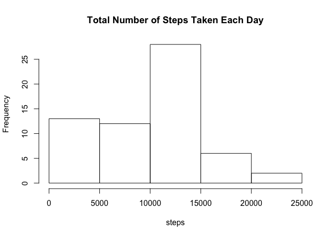
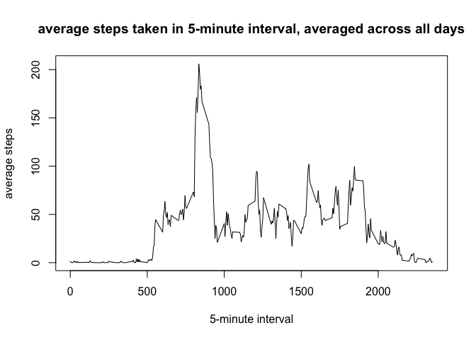
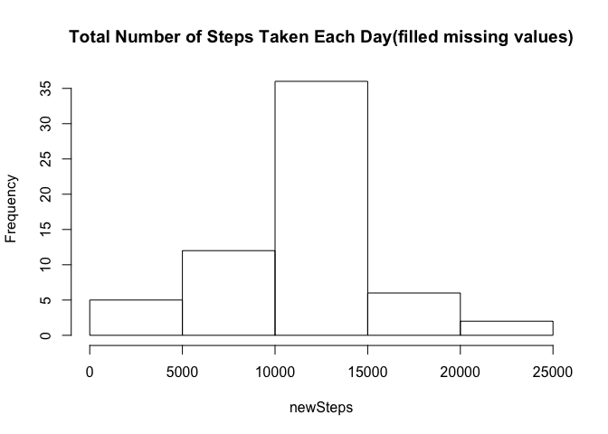

# Reproducible Research: Peer Assessment 1

## Loading and preprocessing the data


```r
stepsData <- read.csv("activity.csv")
```

  
## What is mean total number of steps taken per day?

Calculate the total number of steps taken per day and make a histogram of the total number of steps taken each day.

```r
steps <- tapply(stepsData$steps, stepsData$date, sum, na.rm = TRUE)
hist(steps, main = "Total Number of Steps Taken Each Day")
```

 

Calculate and report the mean and median of the total number of steps taken per day.

```r
mean(steps)
```

```
## [1] 9354.23
```

```r
median(steps)
```

```
## [1] 10395
```
  
## What is the average daily activity pattern?

Make a time series plot of the 5-minute interval and the average number of steps taken, averaged across all days.

```r
stepsByInterval <- tapply(stepsData$steps, stepsData$interval, mean, na.rm = TRUE)
plot(names(stepsByInterval), stepsByInterval, type = "l",
     xlab = "5-minute interval", ylab = "average steps",
     main = "average steps taken in 5-minute interval, averaged across all days")
```

 

Which 5-minute interval, on average across all the days in the dataset, contains the maximum number of steps?

```r
names(which.max(stepsByInterval))
```

```
## [1] "835"
```
  
## Imputing missing values

Calculate and report the total number of missing values in the dataset

```r
sum(is.na(stepsData))
```

```
## [1] 2304
```

Create a new dataset that is equal to the original dataset but with the missing data filled in by the mean for that 5-minute interval.

```r
newStepsData <- stepsData
missingSteps <- is.na(newStepsData$steps)
newStepsData$steps[missingSteps] = stepsByInterval[as.character(newStepsData$interval[missingSteps])]
```

Make a histogram of the total number of steps taken each day and Calculate and report the mean and median total number of steps taken per day. Do these values differ from the estimates from the first part of the assignment? What is the impact of imputing missing data on the estimates of the total daily number of steps?

```r
newSteps <- tapply(newStepsData$steps, newStepsData$date, sum, na.rm = TRUE)
hist(newSteps, main = "Total Number of Steps Taken Each Day(filled missing values)")
```

 

```r
mean(newSteps)
```

```
## [1] 10766.19
```

```r
median(newSteps)
```

```
## [1] 10766.19
```
The impact of imputing missing data is more concentrated on steps between 10000 to 15000.

## Are there differences in activity patterns between weekdays and weekends?

Create a new factor variable in the dataset with two levels – “weekday” and “weekend” indicating whether a given date is a weekday or weekend day.

```r
Sys.setlocale(category = "LC_TIME", locale = "en_US.UTF-8")
```

```
## [1] "en_US.UTF-8"
```

```r
newStepsData$weekdays = weekdays(as.Date(newStepsData$date))
newStepsData$weekdays[!(newStepsData$weekdays %in% c("Saturday", "Sunday"))] = "weekday"
newStepsData$weekdays[newStepsData$weekdays %in% c("Saturday", "Sunday")] = "weekend"
newStepsData$weekdays = as.factor(newStepsData$weekdays)
```

Make a panel plot containing a time series plot of the 5-minute interval (x-axis) and the average number of steps taken, averaged across all weekday days or weekend days (y-axis).

```r
library(lattice)
newStepsByInterval <- tapply(newStepsData$steps, list(newStepsData$interval, newStepsData$weekdays), mean)
newStepsByIntervalDataFrame <- data.frame(
    steps = c(newStepsByInterval[,1], newStepsByInterval[,2]), 
    interval = as.numeric(rep(rownames(newStepsByInterval), 2)), 
    weekdays = c(rep("weekday", 288), rep("weekend", 288))
)
xyplot(steps~interval|weekdays, data=newStepsByIntervalDataFrame,
       type = "l", layout = c(1, 2))
```

 
